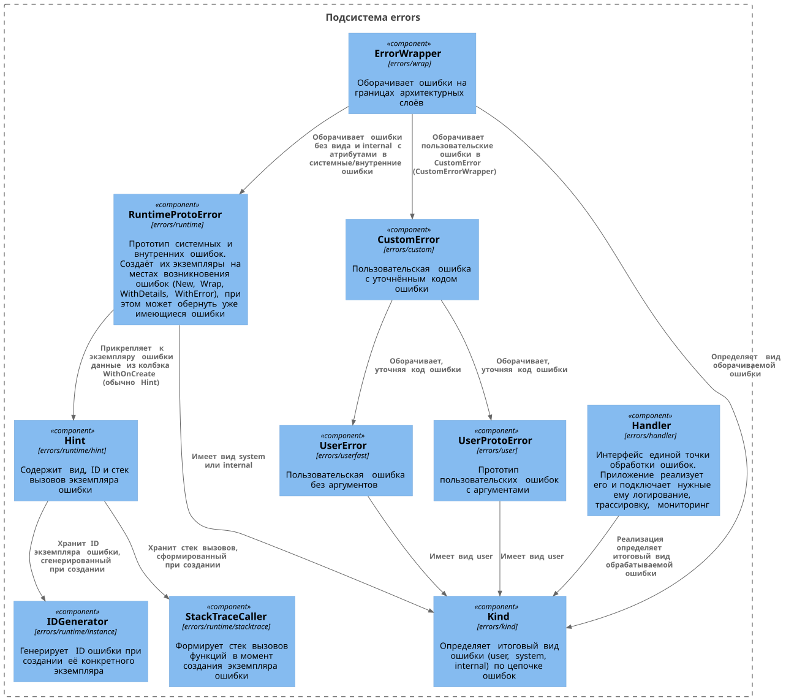
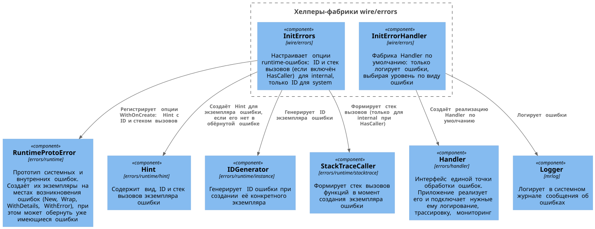
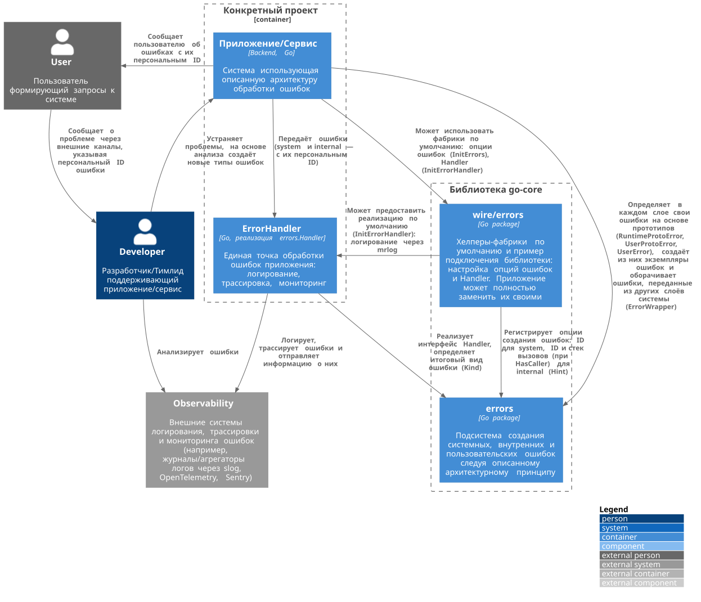

# Описание GoCore v0.15.3
Этот репозиторий содержит описание библиотеки GoCore.

## Статус библиотеки
Библиотека находится в стадии разработки.

## Описание библиотеки
Библиотека решает несколько основных задач:
- формирует пользовательские сообщения на различных языках, в том числе и сообщения об ошибках;
- предоставляет инструменты для более удобной обработки ошибок как пользовательских,
  так и программных согласующихся с Go подходом (более подробно см. ниже);
- предоставляет систему логирования сообщений и ошибок на основе `slog`;
- содержит вспомогательные подсистемы: работа с хранилищами и PostgreSQL, фоновые процессы,
  контроль доступа, трассировка запросов, утилиты;

## Подключение библиотеки
`go get -u github.com/mondegor/go-core@v0.15.3`

## Установка библиотеки для её локальной разработки
- Выбрать рабочую директорию, где должна быть расположена библиотека
- `mkdir go-core && cd go-core` // создать и перейти в директорию проекта
- `git clone git@github.com:mondegor/go-core.git .`
- `cp .env.dist .env`
- `mrcmd go-dev deps` // загрузка зависимостей проекта
- Для работы утилит `gofumpt`, `goimports`, `gci`, `golangci-lint`, `mockgen`, `gotext` необходимо запустить
  `mrcmd go-dev install-tools`. По умолчанию `gofumpt`, `goimports`, `gci`, `golangci-lint` устанавливаются
  последних версий; чтобы закрепить версию, раскомментируйте переменную `GO_DEV_TOOLS_INSTALL_*` в `.env`.
  `mockgen` и `gotext` в go-dev по умолчанию выключены — их версии заданы в `.env.dist`
- `go install ./cmd/gotext-catalog-fix` // установка утилиты, используемой при генерации каталогов локализации

### Консольные команды используемые при разработке библиотеки

> Перед запуском консольных скриптов библиотеки необходимо скачать и установить утилиту Mrcmd.\
> Инструкция по её установке находится [здесь](https://github.com/mondegor/mrcmd#readme)

- `mrcmd go-dev help` // выводит список всех доступных go-dev команд;
- `mrcmd go-dev generate` // генерирует go файлы через встроенный механизм go:generate;
- `mrcmd go-dev gofumpt-fix` // исправляет форматирование кода (`gofumpt -l -w -extra ./`);
- `mrcmd go-dev goimports-fix` // исправляет imports, если это требуется (`goimports -l -w -local ${GO_DEV_IMPORTS_LOCAL_PREFIXES}` для всех go файлов, кроме сгенерированных);
- `mrcmd go-dev gci-fix` // упорядочивает imports (`gci`);
- `mrcmd go-dev lint` // запускает линтеры для проверки кода (на основе `.golangci.yaml`);
- `mrcmd go-dev test` // запускает тесты библиотеки;
- `mrcmd go-dev test-report` // запускает тесты библиотеки с формированием отчёта о покрытии кода (`test-coverage-full.html`);
- `mrcmd plantuml build-all` // генерирует файлы изображений из `.puml` [подробнее](https://github.com/mondegor/mrcmd-plugins/blob/master/plantuml/README.md#%D1%80%D0%B0%D0%B1%D0%BE%D1%82%D0%B0-%D1%81-%D0%B4%D0%BE%D0%BA%D1%83%D0%BC%D0%B5%D0%BD%D1%82%D0%B0%D1%86%D0%B8%D0%B5%D0%B9-%D0%BF%D1%80%D0%BE%D0%B5%D0%BA%D1%82%D0%B0-markdown--plantuml);

#### Короткий вариант выше приведённых команд (Makefile)
- `make deps` // аналог `mrcmd go-dev deps`
- `make deps-upgrade` // аналог `mrcmd go-dev get -u ./...` + `mrcmd go-dev tidy`
- `make generate` // аналог `mrcmd go-dev generate`
- `make lint` // аналог `mrcmd go-dev gofumpt-fix` + `goimports-fix` + `gci-fix` + `lint`
- `make test` // аналог `mrcmd go-dev test`
- `make test-report` // аналог `mrcmd go-dev test-report`
- `make plantuml` // аналог `mrcmd plantuml build-all`

> Чтобы расширить список команд, необходимо создать Makefile.mk и добавить
> туда дополнительные команды, все они будут добавлены в единый список команд make утилиты.

## Обработка ошибок. Общие сведения
### Выделяются три вида ошибок:
- Пользовательские ошибки (user) - все те ошибки, которые должен исправить сам пользователь
  (примеры: недопустимый ввод данных; обращение к несуществующему ресурсу);
- Системные (system) - происходящие в системе и независящие от программы (примеры: отсутствует
  соединение с БД или с каким либо внешним API; отсутствие прав на запись файлов и т.д.);
- Программные (internal) - любые другие ошибки, допущенные разработчиками, или ошибки, которые
  не были классифицированы предыдущими видами (примеры: обращение к нулевому указателю;
  выход из диапазона значений массива; создание файла в несуществующей папке);

### Действия при обработке пользовательской ошибки:
- понятно объяснить причину возникновения;
- предложить варианты действий;
- возможно, превратить ошибку в пользовательский сценарий (например, если логин уже существует,
  то сгенерить похожие варианты и предложить пользователю выбрать один из них);

### Действия при обработке системной ошибки:
- понятно объяснить причину возникновения;
- предложить варианты действий, если возможно;
- сообщить, с чем обратиться в поддержку;
- отобразить уникальный код ошибки, под которым система предварительно записала эту ошибку в логи;
- узнавать об ошибках автоматически, а не от пользователя (т.к. не все пользователи обращаются
  в поддержку, да и оперативное исправление ошибок увеличивает лояльность пользователей);

### Действия при обработке программной ошибки:
- в заголовке всегда пишется фраза типа "Internal error";
- сообщить, с чем обратиться в поддержку;
- показать подробности, если это безопасно;
- отобразить уникальный код ошибки, под которым система предварительно записала эту ошибку в логи;
- узнавать об ошибках автоматически, а не от пользователя;

### Важные замечания:
- К какому виду отнести ту или иную ошибку могут только разработчики, помочь им в этом могут QA специалисты;
- Обработка ошибок - это тоже бизнес логика, поэтому её также нужно продумывать;
- Ошибка является интерфейсом вызова функции, поэтому её необходимо обрабатывать;

### Сценарии работы с ошибками:
- user - понимает что случилось и как это исправить;
- developer - исследует возникшую проблему и выявляет её причины;
- team lead - отслеживает работоспособность системы, выявляет новые ошибки,
  принесённые релизом; оценивает влияние ошибок на пользователей;

## Архитектура обработки ошибок
Внутренний архитектурный слой не должен влиять на поведение верхнего, поэтому ошибки должны быть
частью интерфейса каждого слоя. Определение типов ошибок должны быть в том же слое где возникает
данная ошибка. Причём для каждой ошибки должен быть указан её вид: user, system, internal.

Основная обработка (перехват) ошибок должна происходить в слое UseCase, только он знает как
именно обрабатывать ошибки поступивших из других слоёв, а также правильно определить нужный
вид ошибки. Конкретный слой, обрабатывая ошибку, должен создать объект с ошибкой, определённую
в этом слое, а если этот слой обрабатывает уже перехваченную ошибку, то он должен вложить
её в созданную им ошибку, для того, чтобы внешний перехватчик смог обработать всю цепочку
ошибок и выполнить необходимые действия для каждого вида ошибок.

Чтобы избавить код от текстов пользовательских ошибок, а также одновременно решить проблему
локализации, все тексты пользовательских ошибок необходимо хранить отдельно.

## Пример архитектуры обработки ошибок

### Подсистема формирования ошибок
- [Kind](errors/kind/kind.go) - вид ошибки (user, system, internal) и его определение по цепочке ошибок;
- [RuntimeProtoError](errors/runtime/runtime_error.go) - прототип системных и внутренних ошибок,
  из которого создаются их экземпляры (`New`, `Wrap`, `WithDetails`, `WithError`);
- [UserProtoError](errors/user/user_error.go) - прототип пользовательских ошибок с аргументами;
- [UserError](errors/userfast/user_error.go) - пользовательская ошибка без аргументов;
- [CustomError](errors/custom/custom_error.go) - пользовательская ошибка с уточнённым кодом;
- [Hint](errors/runtime/hint/hint.go) - вид, ID и стек вызовов экземпляра ошибки;
- [GenerateID](errors/runtime/instance/generate_id.go) - генерация ID экземпляра ошибки;
- [StackTrace Caller](errors/runtime/stacktrace/caller.go) - формирование стека вызовов;
- [ErrorWrapper](errors/wrap/error_wrapper.go) - обёртывание ошибок на границах слоёв;
- [Примеры](examples/errors);

### Подсистема обработки ошибок
Библиотека предоставляет единую точку обработки ошибок — интерфейс `Handler`. Приложение реализует его и
само подключает нужные ему логирование, трассировку и мониторинг. Пакет `wire/errors` содержит
хелперы-фабрики по умолчанию и служит примером подключения; его можно полностью заменить.

- [Инициализация ошибок опциями по умолчанию](wire/errors/errors.go);
- [Handler](errors/handler/handler.go) и [его реализация по умолчанию](wire/errors/error_handler.go);
- Библиотека готовых типов ошибок:
  - [Внутренние ошибки](errors/internal_errors.go);
  - [Системные ошибки](errors/system_errors.go);
  - [Пользовательские ошибки, в том числе Http](errors/user_errors.go);
  - [Ошибки событий](errors/event_errors.go);
- Врапперы ошибок:
  - [Для инфраструктурного слоя и слоя бизнес логики](errors/error_wrappers.go);
  - [Для пользовательских ошибок с уточнённым кодом](errors/custom_wrappers.go);

### Верхнеуровневая архитектура системы обработки ошибок

